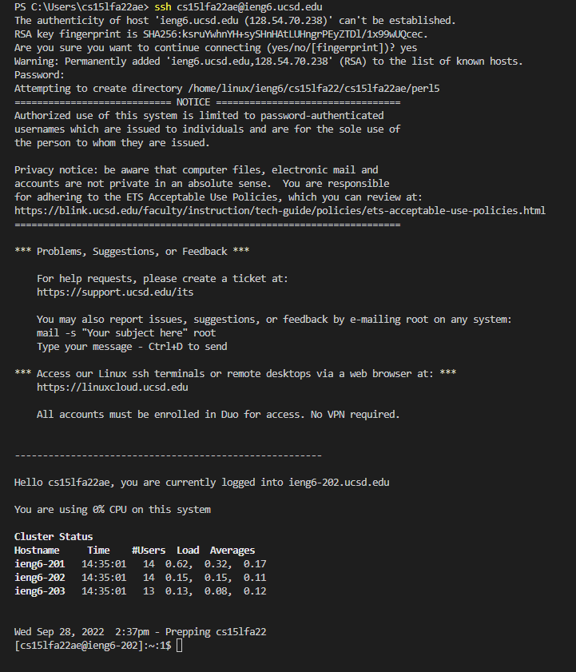
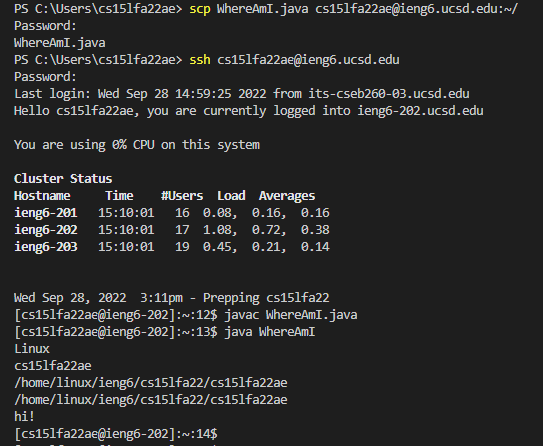
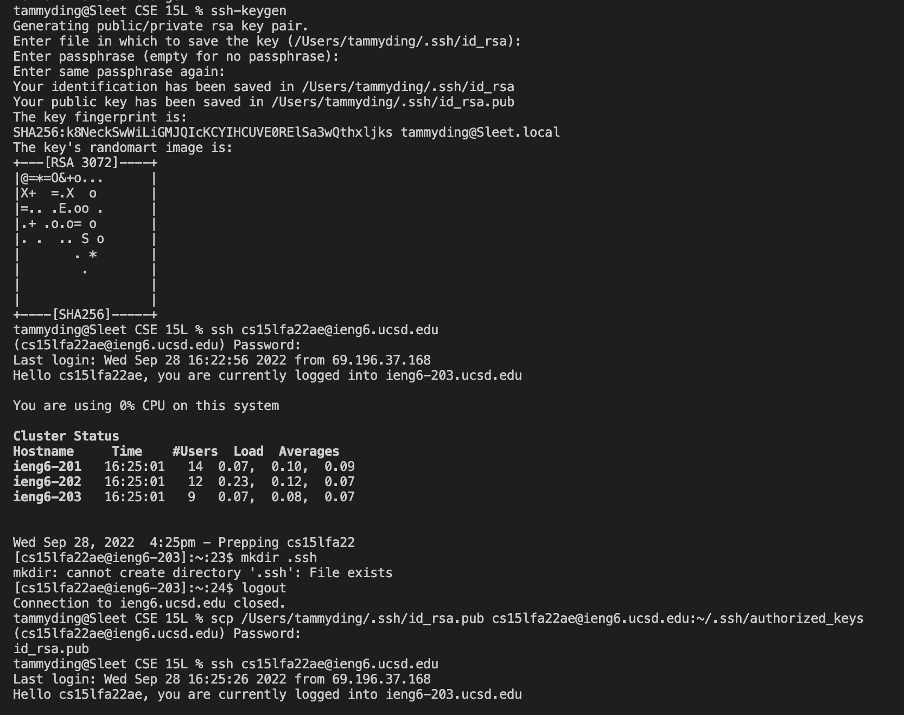

# Week 1 Lab Report - Tutorial

## 1. Install & open Visual Studio Code  

The first step is to install VSCode, the code editor where we will be creating files and labs locally to put on GitHub. I already had this installed, but you can go on VSCode’s website for installation. Open the application after it’s installed and you should see a blank screen as shown below.


  
<br/>

## 2. Remotely connecting  

Next, use the `ssh` command to connect remotely to the remote server. Open terminal to do this, by going to Terminal-->New Terminal menu option.\
Type the following into terminal, with your specific 2 characters in your username in place of "zz".
```
ssh cs15lfa22zz@ieng6.ucsd.edu
```
Then, enter your password, select `yes` if it prompts you with questions, and now your local terminal is connected to a remote computer! Here's how it looked when I connected at first:
  

The next commands you run will be run on that remote server, until you exit/disconnect from it by clicking ctrl+D.  
<br/>

## 3. Trying out some commands  

Familiarize yourself with terminal and explore the remote computer by putting some commands into terminal. Here are some that I tried:

- `cd ~`
- `cd`
- `ls -lat`
- `cp /home/linux/ieng6/cs15lfa22/public/hello.txt ~/`
- `cat /home/linux/ieng6/cs15lfa22/public/hello.txt`  
<br/>  

  
<br/>
In the last part, the command `cat` prints out the contents of the file on the remote computer, which in this case is the pre-made file “hello.txt” in a publicly accessible folder and contains the message that was printed out in the terminal.  
<br/>  

## 4. Moving Files with scp  

You can copy a file from your local computer onto your remote computer, using the command `scp`. 
Type the following into terminal, once again with your specific 2 characters in your username in place of "zz", and the file name of the file you want to move in place of \<fileName>.
```
scp <fileName> cs15lfa22zz@ieng6.ucsd.edu:~/
```
In the screenshot below, I copied a file named WhereAmI.java over onto the remote computer with `scp`, logged in with `ssh`, then compiled and ran the file with `javac` and `java`.  
<br/>
  
<br/>  

## 5. Setting an SSH key  

Entering a password each time you log into the remote computer can be tiring, but there's a way to get rid of that step entirely. On your computer, enter `ssh - keygen`. Whenever it prompts you, just keep hitting enter (when it asks for passphrase, don't type anything in because we want to eliminate the need to type anything in in order to log in).  
Then, log into the remote server using `ssh` as usual. on the server, enter `mkdir .ssh` and then log out using ctrl+D.  
Lastly, back on your host server, type in `scp /Users/joe/.ssh/id_rsa.pub cs15lfa22zz@ieng6.ucsd.edu:~/.ssh/authorized_keys`, replacing "joe" with your user name on your computer.  
After this last step is complete, try logging in again with `ssh`. You should be able to get in without entering a password!  
<br/>  

  
<br/>  

## 6. Optimizing remote running  

Lastly, it's helpful to think of optimizing the process and time it takes to do all of these steps in terminal. Some of the keystrokes can be minimized by condensing multiple commands into one line and using a semicolon to separate them. As seen below in the screenshot where I tried to minimize the keystrokes used as much as possible, I combined compiling and running into one line using semicolons.  
<br/>
