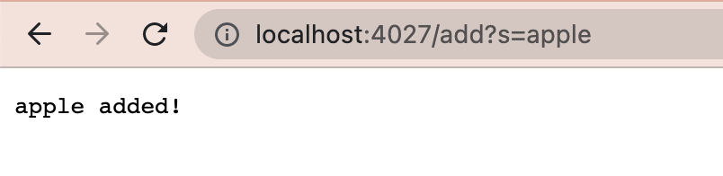
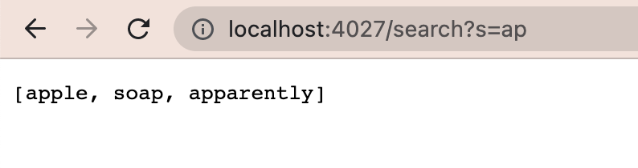
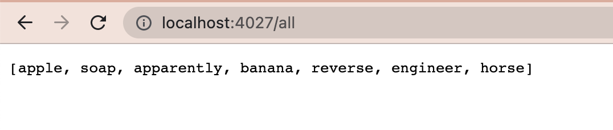
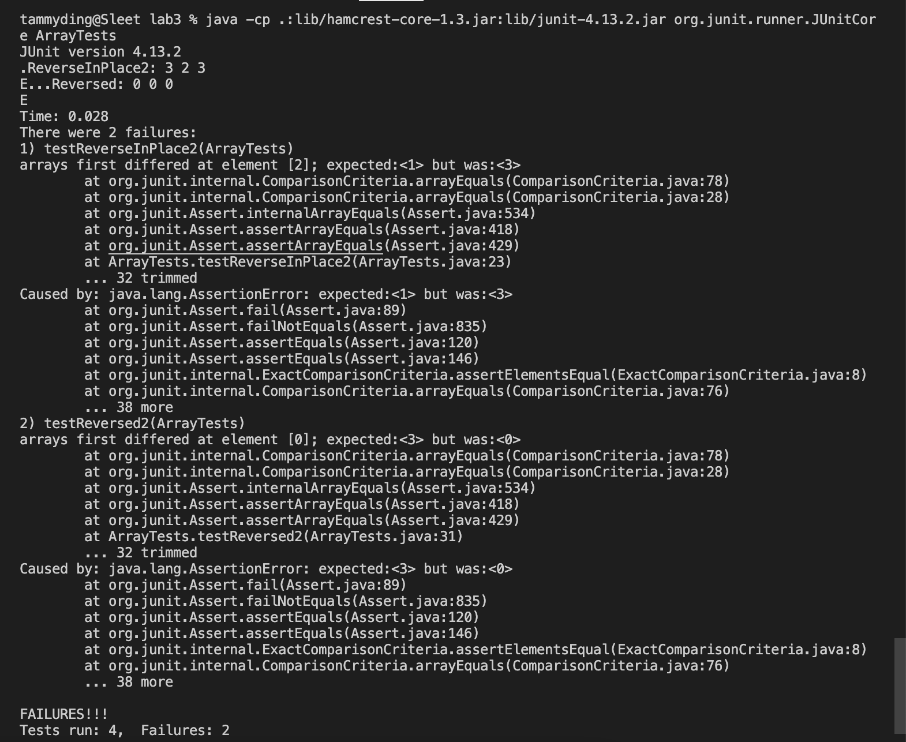

# Week 3 Lab Report

# PART 1: Simplest Search Engine (from week 2) 

Here's my simplest search engine, which adds strings, searches for substrings, and shows all strings.

```
import java.io.IOException;
import java.net.URI;
import java.util.ArrayList;

class EngineHandler implements URLHandler {
    ArrayList<String> strings = new ArrayList<>();

    public String handleRequest(URI url) {
        
        if (url.getPath().equals("/")) {
            return "enter a string to add!";
        }
        else if(url.getPath().equals("/add")){
            String[] parts = url.getQuery().split("="); 
            if (parts[0].equals("s"))
            { 
                strings.add(parts[1]);
                return parts[1] + " added!";
            }
        } 
        else if(url.getPath().equals("/search")){
            String[] parts = url.getQuery().split("="); 
            if(parts[0].equals("s"))
            { 
                ArrayList<String> found = new ArrayList<>();
                for(String string : strings)
                {
                    if(string.contains(parts[1])){
                        found.add(string);
                    }
                }
                return found.toString();
            }

        }
        else if(url.getPath().equals("/all")){
            return strings.toString();
        }
        return "404 Not Found!";
    }
}

class SearchEngine {
    public static void main(String[] args) throws IOException {
        if(args.length == 0){
            System.out.println("Missing port number! Try any number between 1024 to 49151");
            return;
        }

        int port = Integer.parseInt(args[0]);

        Server.start(port, new EngineHandler());
    }
}
```

## 1a: Add a string  
  
**Methods called**  
`handleRequest`  
**Relevent arguments and fields**  
`localhost:4027/add?s=apple`, the URL entered by the user is the argument passed into the parameter `url`.   
The URL is then divided into different fields. First, we get the path, which is the part after 4027 and before the question mark, which is just "/add". Then we get the query, which is the part after the question mark, "s=apple". This query is then parsed into a String array field, `parts`, that's split by the character "=", so that the first element of the array is "s", and the second element is "apple", which is the string to be added.  
The field `strings` is the entire list of strings that have been added. This second element of `parts` is then added to `strings`.  

**How values change**  
The string in the url query gets appended to the field `strings`.  

## 1b: Search for substring  
  
**Methods called**  
`handleRequest`  
**Relevent arguments and fields**  
`localhost:4027/search?s=ap`, the URL entered by the user is the argument passed into the parameter `url`.  
The URL is then divided into different fields. First, we get the path, which is the part after 4027 and before the question mark, which is just "/search". Then we get the query, which is the part after the question mark, "s=ap". This query is then parsed into a String array field, `parts`, that's split by the character "=", so that the first element of the array is "s", and the second element is "ap", which is the string to seach for.  
The field `strings` is the entire list of strings that have been added. This second element of `parts` is then the substring that is searched for in each element of `strings`. A new String ArrayList field, `found`, is created to add the strings from `strings` that contain the substring that's being searched for; strings are added one at a time as `strings` is iterated through.  

**How values change**  
No values are changed  

## 1c: Show all added strings  
  
**Methods called**  
`handleRequest`  
**Relevent arguments and fields**  
`localhost:4027/all`, the URL entered by the user is the argument passed into the parameter `url`.  
The value of the field `strings` is the entire list of strings that have been added.  
**How values change**  
No values are changed  
  
  
# PART 2: Bugs & Symptoms   
In the file `ArrayExamples`, the method `reversed` has some issues.  
The failure-inducing input in my test case was the array {1, 2, 3}. If the code functions properly, it should return the new array {3, 2, 1}.  
However, as you can see in the screenshot below, the output is just an array of zeroes: {0, 0, 0}, which is a symptom of buggy code.  
The bug in this method was that it assigned the empty values of the new array to the old array, and then on top of that it returns the old array. So, what gets returned is just an array of zeroes, since that’s what java defaults the values of an empty array to.
Two fixes are required to correct this bug. 1) Within the for-loop, the code on either side of the equal sign should be flipped, so the values in the old array are assigned to the new array, rather than the other way around. 2) At the end, `newArray` should be returned.  

**My test method:**
```
@Test
  public void testReversed2() {
    int[] test = {1, 2, 3};
    int[] reversed = ArrayExamples.reversed(test);
    System.out.println("Reversed: " + reversed[0] + " " + reversed[1] + " " + reversed[2]);
    assertArrayEquals(new int[]{3, 2, 1}, reversed);
  }
```

**Terminal output:**
  

**My corrected method:**
```
  static int[] reversed(int[] arr) {
    int[] newArray = new int[arr.length];
    for(int i = 0; i < arr.length; i += 1) {
      newArray[arr.length - i - 1] = arr[i];
    }
    return newArray;
  }  
```  
   

In the file `ListExamples`, the method `merge` is buggy.  
The failure-inducing input in my test case was 2 arrays, each with 3 letters. The expected/correct merge of them is the first 6 letters of the alphabet; {"a", "b", "c", "d", "e", "f"}.  
However, the test enters an infinite loop when ran, which is a symptom of a bug in the code.  
Upon closer investigation, the bug is located in the last while loop of the method, which results in an infinite loop. The while condition written is never broken, since it’s dependent on index2 increasing, but it’s incrementing index1 instead. So, the loop never ends.  

**My test method:**
```
@Test 
	public void testFilter() {
        List<String> input1 = new ArrayList<>(Arrays.asList("a", "c", "e"));
        List<String> input2 = new ArrayList<>(Arrays.asList("b", "d", "f"));
        List<String> expected = new ArrayList<>(Arrays.asList("a", "b", "c", "d", "e", "f"));
        assertEquals(expected, ListExamples.merge(input1, input2));
    }
```
**Terminal output:**
  

**The corrected while loop:**
```
while(index2 < list2.size()) {
    result.add(list2.get(index2));
    index2 += 1;
}
```