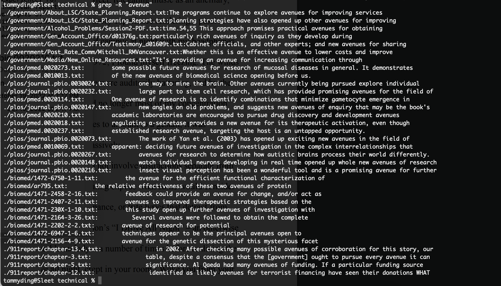
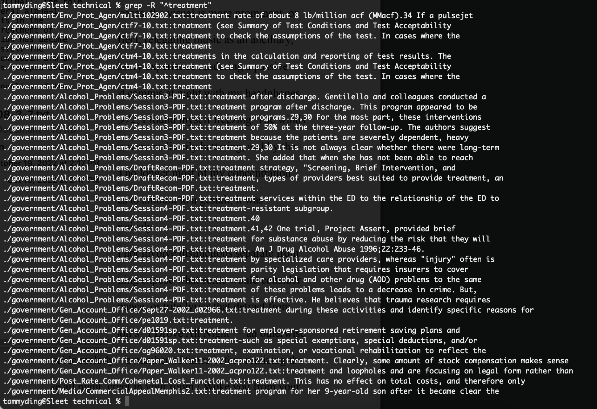
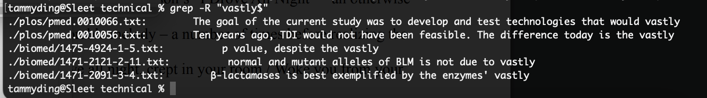
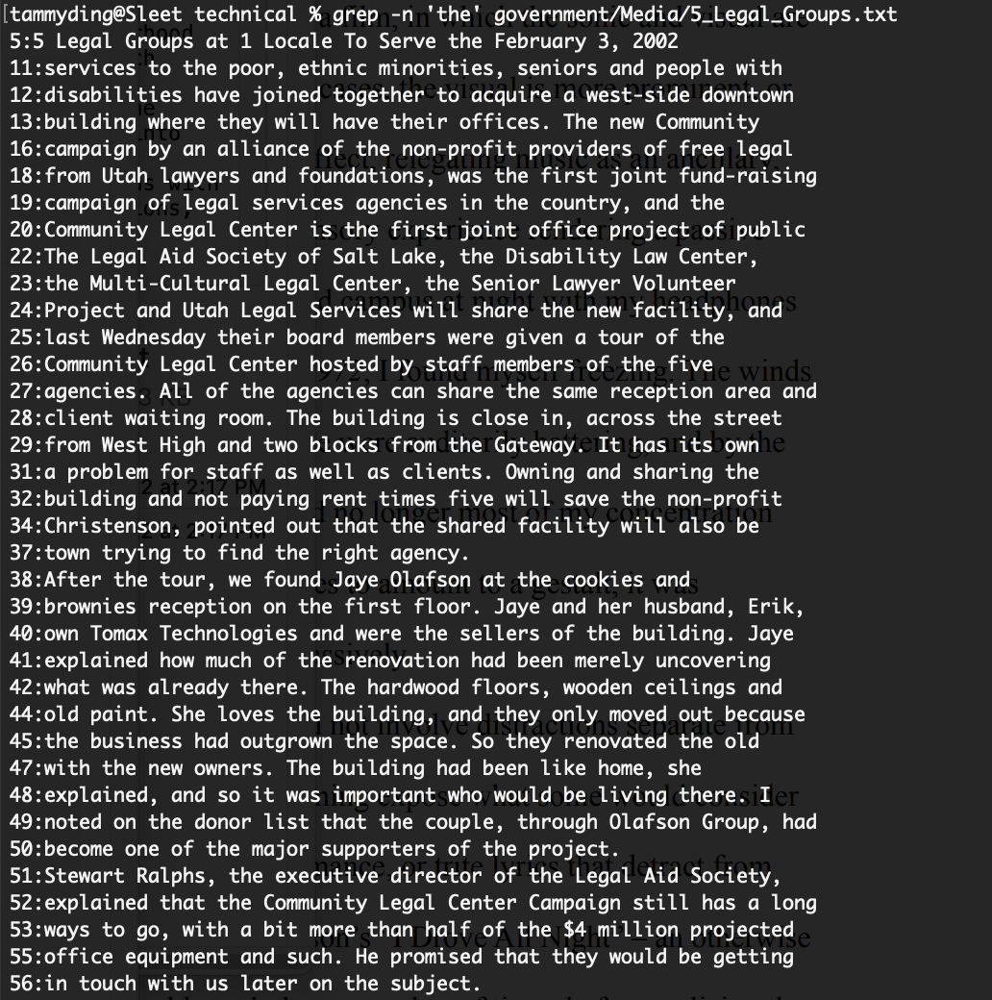
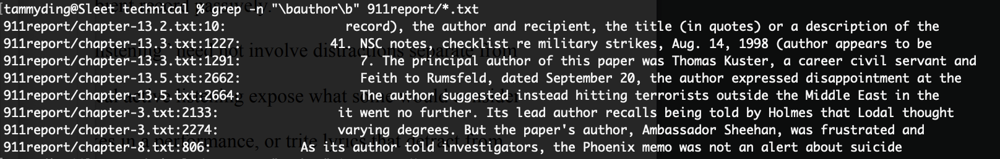
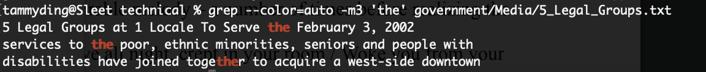
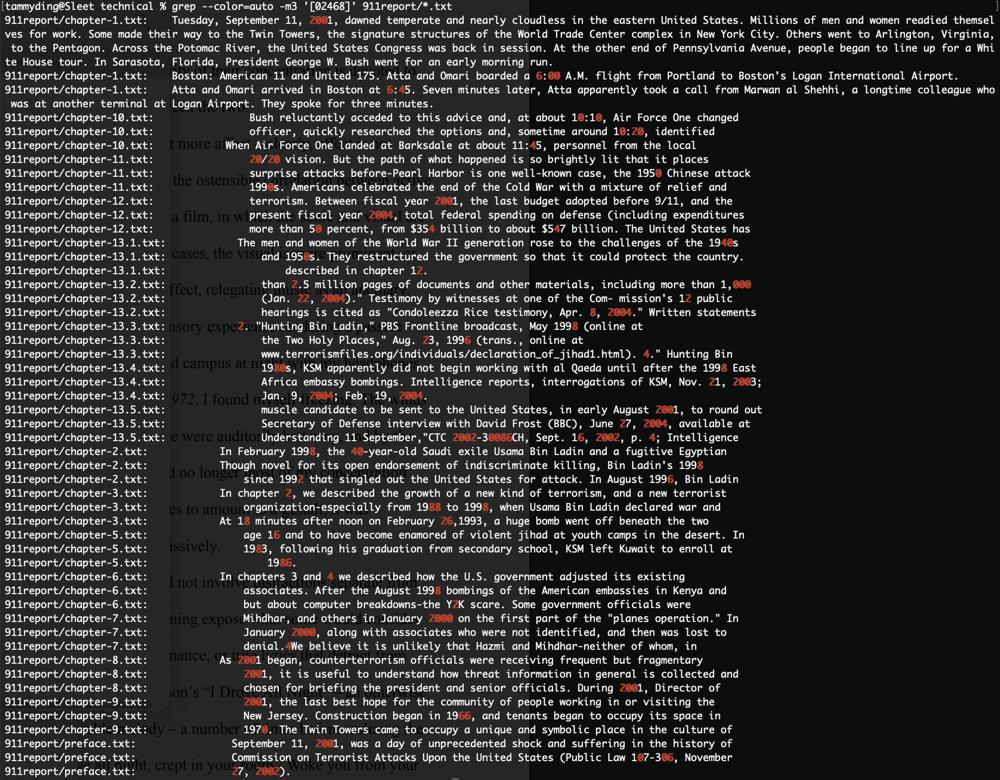

# Week 5 Lab Report

## RESEARCHING COMMANDS - `GREP`  

I researched the `grep` command, in particular the command-line options `-R`, `-n`, and `--color=auto`.

## `-R`: Recursive search; reads all files under each directory
**Example 1**  

The option '-R' searches recursively through all the folders within the current directory, allowing you to search for a string within all the files. Here, I'm searching for the term "avenue" in everything under `./terminal`, and it displays not only the line where the search string was found, but also the specific path that which the line is under.

**Example 2**  

Here, I included a carat: `^`, which is a Regular Expression (RegEx) character. It anchors the string to the front of a line, so it searches for where the word "vastly" appears, but only where it's located at the start of a line.

**Example 3**  

Here, I included a dollar symbol: `$`, which is another Regular Expression (RegEx) character for anchoring. This time, it anchors the string to the end of a line, so it searches for where the word "treatment" appears, but only where it's located at the end of a line.
  
## `-n`: Shows the line number of matching lines
**Example 1**  
  
The feature `-n` shows the line number along with the line in which a search string is found. This example shows all the lines in the file "5_Legal_Groups.txt" that contain the string "the".

**Example 2**  

This example looks for the string "relocate" under all the .txt files that are within the `./government/Media` directory. These files are searched through since the asterisk `*` takes the place of the names of any files, so `*.txt` accounts for all the .txt files.

**Example 3**  

This example looks for the string "author" under all the .txt files that are within the `./911report` directory. Like the previous example, using `*.txt` allows us to search through multiple files. I included another RegEx character here, `\b`, which signifies a word boundary. So, in this example, it excludes options such as "authorities" or "authoritative", because `\bauthor\b` looks for specifically when the word is just "author" with no other characters around it.

## `--color=auto`: Highlights search string in a different color
**Example 1**  
  
`--color=auto` highlights the searched string in all the lines where it's found. Here, I searched for the term "household", anchored to the back of a line with `$`, recursing through all files under the parent directory `./terminal`.

**Example 2**  

In this example, I limited the amount of matching lines to 3 with the command `-m3`, and searched for the term "the" in one file. With `--color=auto`, it just shows 3 lines where "the" is found, and it displays highlighted in red.

**Example 3**  

Here, I limited the amount of matching lines within each file to 3 again with `-m3`, and searched for places where any of the digits in the set `[02468]` appear (brackets are another piece of RegEx syntax). It checked all the files in the directory `./911report` using `*.txt`, and the digits in the number set that are in the text files are displayed in red.