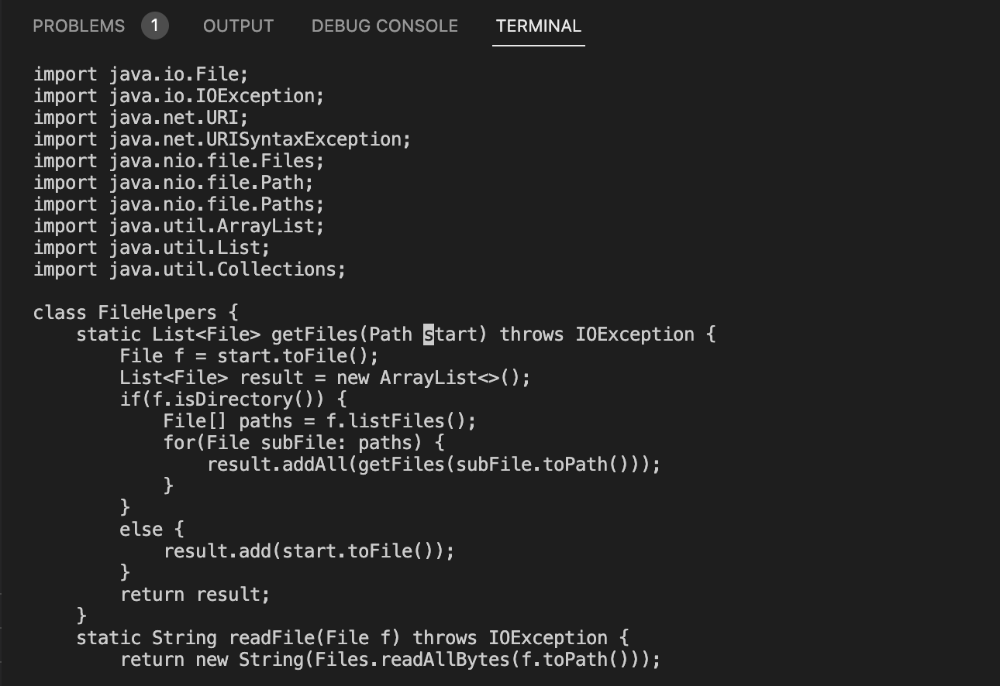
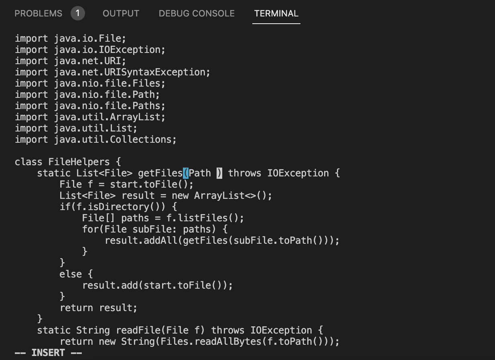
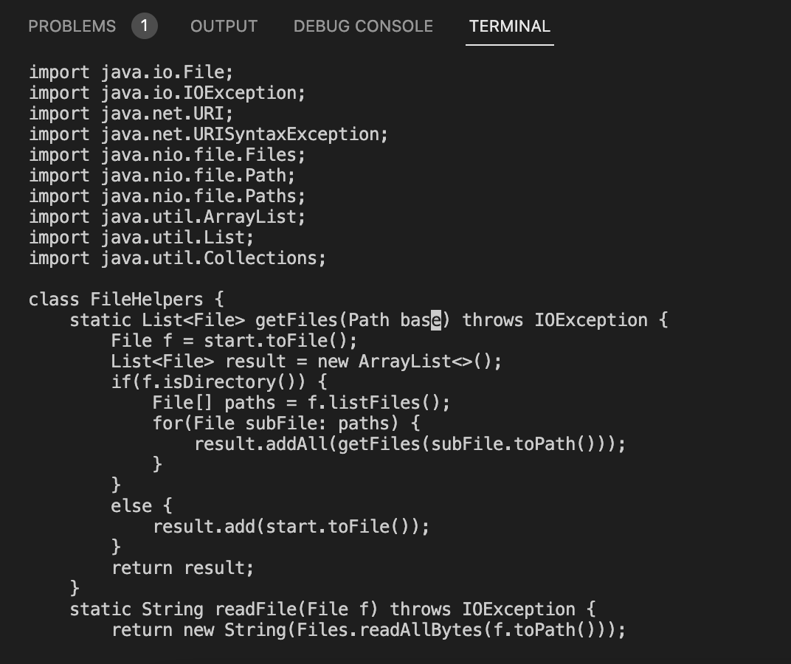
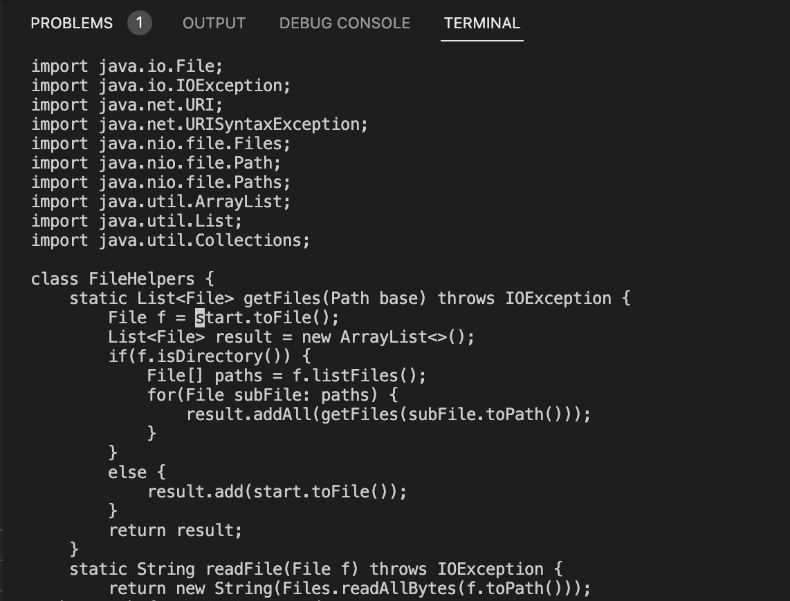
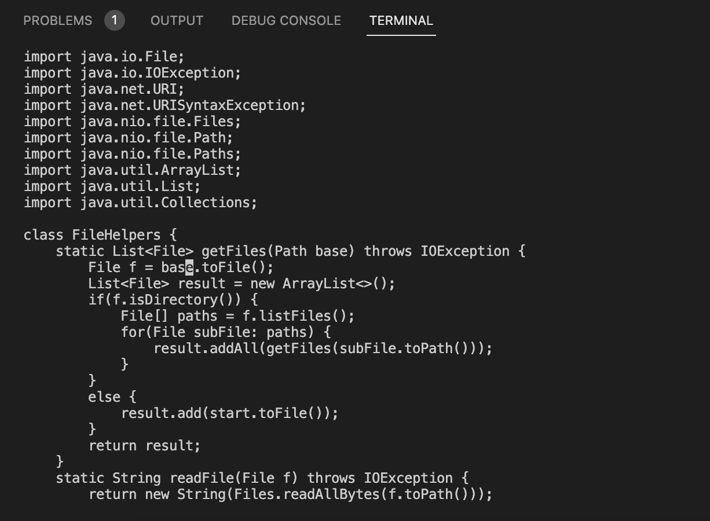
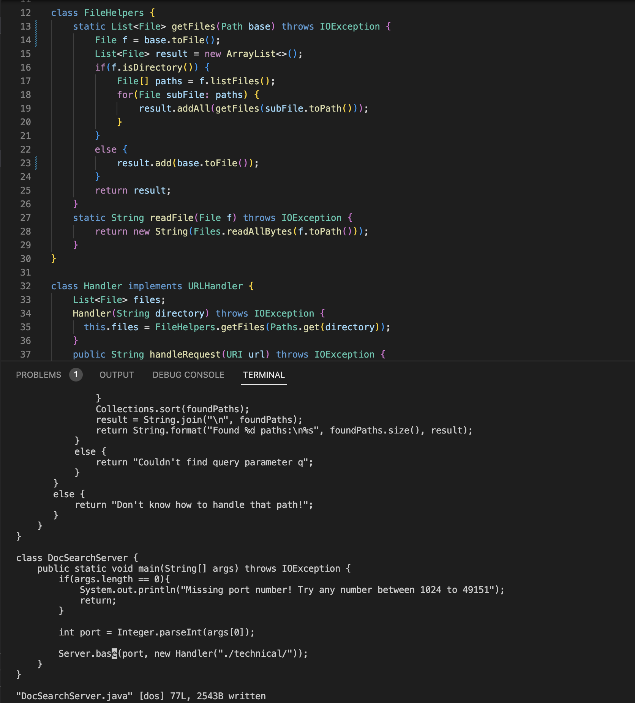

# Week 7 Lab Report

## Using VIM  

---

## Part 1
The task I chose was "Changing the name of the start parameter and its uses to base". The shortest sequence of VIM commands I found is **`/star<Enter>cebase<Esc>n.n.n.:w<Enter>`**, which only uses 22 keystrkes. Here's a step-by-step explanation of how this command works.

Then, for each command where you move the cursor or change the text, take a screenshot and describe which commands/keypresses got to that step.

**1. `/star<Enter>`**  
  
The `/` command searches for the following sequence of characters and pressing `<Enter>` moves it to where the string appears in the file. Here, although we are searching for the word "start", all the instances of it can be located by just searching "star", since no other word in the file contains those four characters in a row.  

**2. `ce`**  
  
The letters `ce` used in conjunction with each other erases to the end of the word that the cursor is currently on. `c` puts Vim in change mode, which takes on a motion, so we also don't have to press `i` in order to edit the text.`e` is the motion of erasing. In this instance, it deletes the word "start", where the cursor had been displaced to.  

**3. `base<Esc>`**  
  
Typing in `base` takes the place of where the word "start" used to be. Pressing `<Esc>` takes Vim out of insert mode.

**4. `n.` (x3)**  
  
  
The characters `n.` together function as a find-and-replace function. `n` repeats the last search that was made, so it finds the next instance of "start" and places the cursor there. This is shown in the first screenshot. The period `.` replicates the last edit change that was made when Vim was in edit mode, so it replaces the word "start" with "base". This is shown in the second screenshot. As a whole, this command is repeated 3 times to replace all the instance of "start" to "base" in the file.

**5. `:w<Enter>`**  
  
Lastly, the `:w` command saves, or "writes", the changes made to the file. Pressing `<Enter>` enacts that saving process.  

---

## Part 2  
It took me around 2 minutes (130 seconds) to make the edit and copy it in the remote server. There was a lot more meticulous labor to be done in this process, including searching for and replacing the word "start" manually, and typing in the long lines required to log in and copy the file over.  

However, starting already logged into an `ssh` session and then using Vim in the remote server to make my changes directly only took 55 seconds. It was much quicker and more direct, with less intermediate steps required.  

In the future, I imagine that I would prefer to use the second method if I had to work on a program that was running remotely. It's faster and more reliable to make the changes directly in the remote server, so no edits are forgotten or somehow not carried over locally. Vim also makes the changes faster, since there are more automated processes for making the edits and I can minimize keystrokes that way.  

The caveat for this is that I would like it more if I became more familiar with Vim, because that on its own is a skill/language to learn, and it will only be more efficient if I know how to navigate the commands fluently and with ease. In this particular case, it was definitely quicker to use Vim after being logged into `ssh`, but that's likely because I've run through the task numerous times already and know the Vim commands by heart.